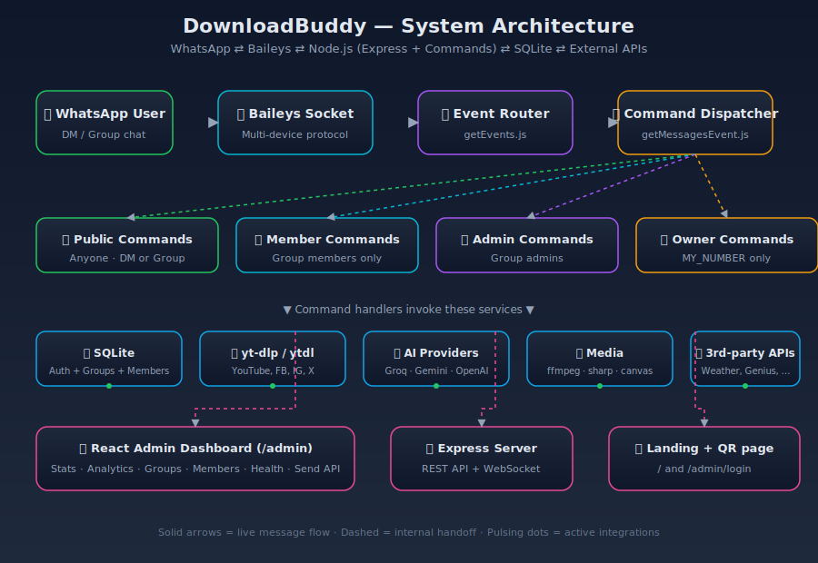
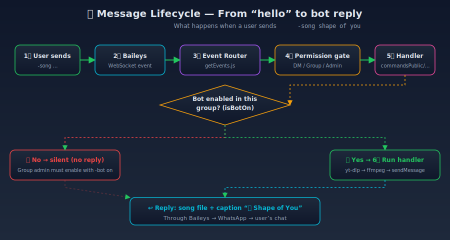
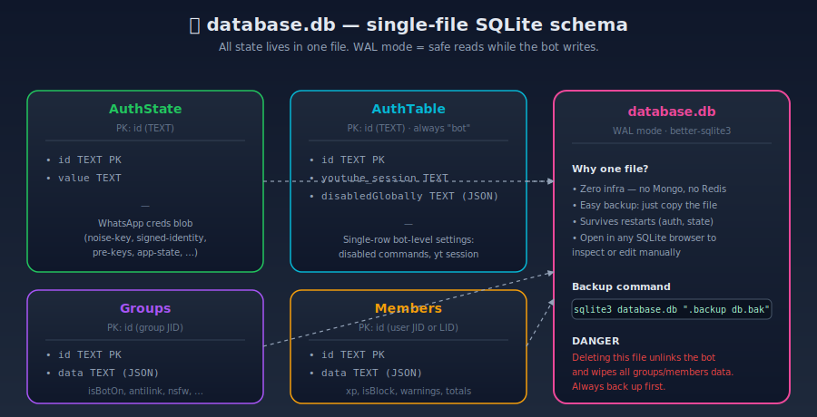
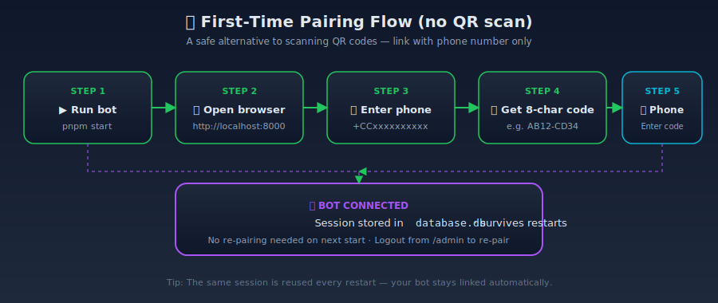
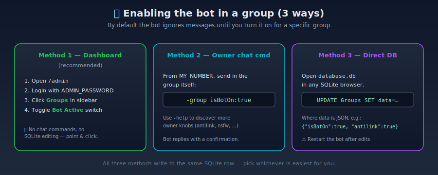
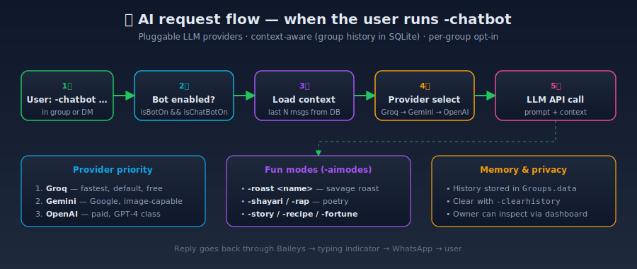

# DownloadBuddy — WhatsApp Bot 🤖

> A self-hosted, multi-device WhatsApp bot with a **React admin dashboard**,
> **95+ commands**, **AI chat**, **YouTube / Facebook / Instagram downloaders**,
> **group moderation** and **persistent analytics** — all in a single
> Node.js process backed by SQLite.


<p align="center">
  
</p>

---

## 📑 Table of contents

1. [What is this?](#-what-is-this)
2. [How it works (the 30-second tour)](#-how-it-works-the-30-second-tour)
3. [Feature list](#-feature-list)
4. [All commands](#-all-commands)
5. [Database schema](#-database-schema)
6. [Quick start (5 minutes)](#-quick-start-5-minutes)
7. [First-time pairing](#-first-time-pairing)
8. [Enabling the bot in a group](#-enabling-the-bot-in-a-group)
9. [Admin dashboard tour](#-admin-dashboard-tour)
10. [How AI / chatbot works](#-how-ai--chatbot-works)
11. [Adding a new command](#-adding-a-new-command-advanced)
12. [Deployment](#-deployment)
13. [Environment variables](#-environment-variables)
14. [Architecture & file map](#-architecture--file-map)
15. [Troubleshooting](#-troubleshooting)
16. [Credits & license](#-credits--license)

---

## 🤔 What is this?

**DownloadBuddy** is a WhatsApp bot you run on **your own machine or VPS**.
Once you link your phone number, the bot can:

- 📥 Download videos / songs from **YouTube, Facebook, Instagram, Twitter/X, Pinterest, Reddit**
- 🤖 Chat with users using **Groq / Gemini / OpenAI** (pluggable, you pick the provider)
- 🛡️ Moderate groups — anti-link, NSFW image filter, warnings, kick/ban, hidden tag
- 📊 Track per-member and per-group **message statistics**, XP & levels
- 🎛️ Expose a **React admin dashboard** at `/admin` for live control
- 📣 Broadcast messages, run a quiz bot, transcribe voice notes — 95+ commands total

Everything is stored in a single file — `database.db` — so there is **no
external database to set up**.

### Who is this for?

| You are… | DownloadBuddy helps you… |
|----------|--------------------------|
| A group admin | Run a fun, well-behaved community bot |
| A developer | Fork it and add custom commands in minutes |
| A self-hoster | Deploy on Railway / Docker / Heroku with one click |
| A beginner | Follow the 5-minute quick-start below 👇 |

---

## ⚡ How it works (the 30-second tour)

<p align="center">
  
</p>

**In one sentence:** your phone talks to WhatsApp’s servers → Baileys (a Node.js
library) receives the messages → your command handlers run → a reply is sent
back through the same pipe.

### What happens when a user sends a command?

<p align="center">
  
</p>

> The “Bot enabled in this group?” gate is important: **the bot ignores
> messages in groups unless an admin turns it on for that group.** See
> [Enabling the bot in a group](#-enabling-the-bot-in-a-group).

---

## 🌟 Feature list

- 📥 **Downloaders** — YouTube (`-yt`, `-ytv`, `-vs`, `-yta`, `-song`, `-play`),
  Facebook (`-fb`), Instagram (`-insta`, `-i`), Twitter/X (`-twitter`, `-tw`, `-x`),
  Pinterest (`-pin`), Reddit, TikTok via `yt-dlp` with graceful fallback to
  `@distube/ytdl-core`
- 🤖 **AI** — Groq (default, fast & free), Google Gemini, OpenAI, plus 6
  “fun modes” (`-aimodes`): roast, shayari, rap, fortune, story, recipe
- 🖼️ **Stickers & media** — `-sticker`, `-steal`, `-meme`, `-removebg`,
  animated text stickers (`-attp`), 3 image generators (`-gen`, `-gen2`, `-make`)
- 🛡️ **Moderation** — `-antilink`, `-nsfwfilter`, `-warn` / `-unwarn`,
  `-ban` / `-kick` / `-remove`, `-tagall`, `-hidetag`, `-welcome`, NSFW image
  detection
- 📊 **Analytics** — per-member message counts, XP/levels, top groups,
  message-type pie chart
- 🗄️ **SQLite persistence** — auth, groups, members, warnings, blocked users,
  chatbot history in one file
- 🎛️ **React admin dashboard** — stats, analytics, group/member management,
  bot health, broadcast, send-via-API, QR/pairing-code control
- 🔄 **Auto-reconnect** with backoff and session recovery
- 🔒 **Pairing-code login** — no QR scan, no second device
- 🐳 **One-click deploys** — Railway, Docker, Heroku, Koyeb, Render, Fly.io

---

## 🤖 All commands

> The default prefix is `-` (set in `.env` as `PREFIX=`). Run `-help` in any
> chat to get the **live, always-current** command list generated from the
> actual command files.

### Public commands (33) — anyone, anywhere

| Command(s) | What it does | Example |
|------------|--------------|---------|
| `-help` / `-menu` | Full command list with categories | `-help` |
| `-start` | Welcome / intro message | `-start` |
| `-alive` / `-a` / `-ping` | Bot uptime & ping | `-alive` |
| `-dev` / `-developer` | Developer & repo info | `-dev` |
| `-donate` / `-donation` | Support the dev | `-donate` |
| `-sticker` / `-s` | Image / video / GIF → sticker | reply to media with `-sticker` |
| `-steal` | Re-send a sticker with bot metadata | reply to sticker with `-steal` |
| `-sets` / `-stealText` | Set custom pack name / author for `-steal` | `-sets My Pack\|Me` |
| `-toimg` / `-image` | Sticker → image | reply to sticker |
| `-text` / `-txt` / `-texmeme` | Add header/footer text to image | reply to image with `-text` |
| `-attp` / `-textsticker` / `-ts` | Animated coloured text sticker | `-attp hello` |
| `-mp3` / `-tomp3` | Video/audio URL → MP3 | `-mp3 <url>` |
| `-mp4` | Any video URL → MP4 | `-mp4 <url>` |
| `-mp3convt` / `-mp4audio` / `-tomp3` | Convert any media URL to MP3 | `-mp3convt <url>` |
| `-song` / `-play` | Search & download a song | `-song shape of you` |
| `-yt` / `-ytv` / `-vs` | YouTube URL → video | `-yt <url>` |
| `-yta` | YouTube audio only | `-yta <url>` |
| `-fb` / `-facebook` / `-fbdl` | Facebook video download | `-fb <url>` |
| `-insta` / `-i` | Instagram media | `-insta <url>` |
| `-twitter` / `-tw` / `-x` | Twitter/X video | `-twitter <url>` |
| `-pin` | Pinterest video/image | `-pin <url>` |
| `-reddit` | Posts from a subreddit | `-reddit memes` |
| `-img` | Google image search | `-img cute cats` |
| `-search` / `-google` | Google web search | `-search quantum computing` |
| `-news` / `-categories` / `-cate` | Latest news (optional category) | `-news sports` |
| `-joke` | Random joke (optional category) | `-joke programming` |
| `-meme` | Random meme | `-meme` |
| `-fact` | Random fun fact | `-fact` |
| `-quote` | Inspirational quote | `-quote` |
| `-proquote` / `-pqoute` | Programming quote | `-proquote` |
| `-qpt` / `-qpoetry` | Quote-as-poetry | `-qpt` |
| `-advice` | Random life advice | `-advice` |
| `-weather` / `-w` | Current weather | `-weather Mumbai` |
| `-translate` / `-tr` | Translate text | `-translate hi hello` |
| `-calc` / `-calculate` | Calculator | `-calc 2+2*3` |
| `-ud` / `-urban` | Urban Dictionary | `-ud yeet` |
| `-dic` / `-dict` | Dictionary definition | `-dic love` |
| `-gender` | Guess gender from name | `-gender Alex` |
| `-l` / `-lyric` | Song lyrics | `-l shape of you` |
| `-idp` / `-dp` | Instagram profile picture (HD) | `-idp username` |
| `-removebg` / `-bg` | Remove image background | reply to image |
| `-remind` / `-reminder` | Set a reminder | `-remind 10m drink water` |
| `-qr` / `-qrcode` | Generate QR code | `-qr https://example.com` |
| `-poll` / `-vote` | Create a WhatsApp poll (use `\|`) | `-poll "Best lang?" \| py \| js \| go` |
| `-confess` / `-anon` | Anonymous confession to the group | `-confess I love this group` |
| `-level` / `-lvl` / `-rank` | Your XP, level, rank | `-level` or `-level lb` |
| `-mycount` / `-total` | Your message count in this group | `-mycount` |
| `-totalg` | Your total messages across groups | `-totalg` |
| `-stats` | Your global message stats | `-stats` |
| `-nsfw` | Check if an image is NSFW | reply to image |
| `-epicgames` | Free Epic Games deals | `-epicgames` |
| `-transcribe` / `-tr2` / `-vtt` | Voice note → text (Whisper) | reply to voice note |
| `-runcode` | Run arbitrary code (sandboxed, owner) | `-runcode console.log(1)` |
| `-delete` / `-d` / `-dd` | Delete a bot message | reply to bot msg |
| `-un` | Course API (Udemy-style) | `-un <query>` |

### AI commands

| Command(s) | What it does | Notes |
|------------|--------------|-------|
| `-chatbot` / `-downloadbuddy` / `-db` | Default LLM chat (history-aware) | Set `-chat on` in group first |
| `-gemini` / `-groq` / `-llama` | Direct Gemini query | Provider in env |
| `-imagine` / `-dream` | Free AI image generator from prompt | Uses Google GenAI |
| `-gen` / `-genimg` / `-imagen` | AI image gen (v1) | Google GenAI |
| `-gen2` / `-genimg2` / `-flashgen` | AI image gen (v2) | Google GenAI |
| `-make` | Another image generator | Google GenAI |
| `-aimodes` aliases: `-roast`, `-shayari`, `-rap`, `-fortune`, `-story`, `-recipe` | AI “fun modes” | Uses Groq by default |

> 💡 These overlap by design — the file `commands/public/chatbot.js` is the
> main AI handler and exposes multiple aliases for ergonomic use.

### Group member commands (35) — any member of a group

| Command(s) | What it does |
|------------|--------------|
| `-getwarn` | List all warnings in this group |
| `-un` | Course API lookup (Udemy) |
| `-image` / `-toimg` | Convert sticker to image |
| `-text` / `-txt` / `-texmeme` | Add header/footer text to image |
| `-gen` / `-genimg` / `-imagen` | AI image gen v1 |
| `-gen2` / `-genimg2` / `-flashgen` | AI image gen v2 |
| `-make` | AI image gen (alt) |
| `-img` | Google image search |
| `-removebg` / `-bg` | Remove image background |
| `-pin` | Pinterest downloader |
| `-insta` / `-i` | Instagram downloader |
| `-song` / `-play` | Song downloader |
| `-yta` | YouTube audio-only |
| `-yt` / `-ytv` / `-vs` | YouTube video |
| `-twitter` / `-tw` / `-x` | Twitter/X downloader |
| `-mp3convt` / `-mp4audio` / `-tomp3` | URL → MP3 |
| `-news` / `-categories` / `-cate` | News |
| `-joke` | Random joke |
| `-meme` | Random meme |
| `-quote` | Inspirational quote |
| `-proquote` / `-pqoute` | Programming quote |
| `-qpt` / `-qpoetry` | Quote-poetry |
| `-advice` | Life advice |
| `-fact` | Fun fact |
| `-horo` / `-horoscope` | Horoscope |
| `-gender` | Gender from name |
| `-ud` / `-urban` | Urban Dictionary |
| `-dic` / `-dict` | Dictionary |
| `-l` / `-lyric` | Song lyrics |
| `-mycount` / `-total` | Your message count here |
| `-totalg` | Your cross-group message count |
| `-true` / `-truecaller` | Truecaller lookup |
| `-headerfooter` | Inspect bot header/footer config |
| `-nsfw` | NSFW image check |
| `-cmdRun` (`-runcode`) | Execute code (sandboxed, member scope) |

### Group admin commands (20) — admins in a group

| Command(s) | What it does |
|------------|--------------|
| `-bot` | Toggle bot on/off for this group |
| `-chat` | Enable/disable member-level chatbot |
| `-antilink` | Toggle anti-link filter (auto-delete links) |
| `-nsfwfilter` / `-nsfwon` | Toggle NSFW image filter (auto-delete explicit images) |
| `-warn` / `-unwarn` | Add / remove a warning |
| `-tagall` | Mention every member |
| `-rn` / `-rt` | Random-tag one member |
| `-add <number>` | Add a member (with country code) |
| `-remove` / `-kick` / `-ban` | Remove a member |
| `-promote` | Promote to admin |
| `-demote` | Demote admin |
| `-setname` / `-setsubject` | Change group subject |
| `-welcome` | Set welcome message |
| `-link` | Get group invite link |
| `-count` | Per-member message counts |
| `-zero` | Members with zero / low message count |
| `-blockc` / `-emptyc` / `-getblockc` / `-removec` | Block/unblock a command in this group |
| `-delmsg` | Delete a message (admin scope) |
| `-exec` / `-execute` | Run code (admin scope) |
| `-admin` | Show admin-only help |

### Owner commands (10) — `MY_NUMBER` only

| Command(s) | What it does |
|------------|--------------|
| `-block` / `-unblock` | Block / unblock a user globally |
| `-bb` / `-broadcast` | Send to all groups (also via dashboard) |
| `-clearhistory` / `-cleardownloadbuddy` / `-resetdownloadbuddy` / `-forgetdownloadbuddy` | Clear chatbot conversation history for this group |
| `-hidetag` | Hidden tag — invisible mention to everyone |
| `-jid` / `-lid` | Get your JID or LID (Baileys v7+ dual ID) |
| `-removebot` | Bot leaves the group |
| `-owner` / `-ownerhelp` / `-ownermenu` | Owner-only help |
| `-test` / `-code` | Run code (owner scope, marked **dangerous**) |
| `-group` / `-member` / `-bot` | Raw DB control (set fields directly) |
| `-downloadbuddyinfo` / `-downloadbuddystat` / `-downloadbuddystatus` | Inspect chatbot history for this group |

> 📌 The list above is **generated from the actual command files** (their
> `cmd:` and `desc:` exports). If a command doesn't match your installed
> version, run `-help` in WhatsApp — it pulls from the live command loader.

---

## 🗄️ Database schema

Everything lives in **one file**: `database.db` (SQLite, WAL mode). Four tables:

<p align="center">
  
</p>

| Table | Purpose | Key fields |
|-------|---------|------------|
| `AuthState` | Baileys session blob (noise-key, signed-identity, pre-keys, app-state) | `id`, `value` |
| `AuthTable` | Bot-level settings — always 1 row where `id="bot"` | `id`, `youtube_session`, `disabledGlobally` (JSON) |
| `Groups` | Per-group config — one row per group JID | `id`, `data` (JSON: isBotOn, antilink, nsfw, …) |
| `Members` | Per-user stats & state — one row per user JID or LID | `id`, `data` (JSON: xp, isBlock, warning, totals) |

**Why one file?** Zero infra (no Mongo, no Redis), easy backups
(`sqlite3 database.db ".backup db.bak"`), survives restarts, open in any
SQLite browser to inspect or edit. **Deleting it unlinks the bot and wipes
all data** — always back up first.

---

## 🚀 Quick start (5 minutes)

### Prerequisites

| Tool | Why | Install |
|------|-----|---------|
| **Node.js 22.x** | Runs the bot | https://nodejs.org |
| **pnpm 9.x** | Faster package manager | `npm i -g pnpm` |
| **ffmpeg** | Audio/video processing (stickers, MP3, video) | `brew install ffmpeg` / `apt install ffmpeg` / `choco install ffmpeg` |
| **yt-dlp** | YouTube / FB / IG / Twitter / Pinterest downloads | `brew install yt-dlp` / `pipx install yt-dlp` / `winget install yt-dlp` |
| **Git** | Clone the repo | https://git-scm.com |

> YouTube/song/MP3/MP4/FB/IG/Twitter/Pin commands **will fail** without `yt-dlp`
> on PATH. All other commands (AI, stickers, moderation, dashboard) work fine
> without it.

### Install & run

```bash
# 1. Get the code
git clone https://github.com/soumyachk101/Whatsapp-OG-Bot.git
cd Whatsapp-OG-Bot

# 2. Install Node dependencies
pnpm install

# 3. Configure your secrets
cp .env.example .env
# Open .env in any editor and set at minimum:
#   PREFIX=-
#   MY_NUMBER=919876543210          # owner WhatsApp number, no +
#   MODERATORS=919876543210         # comma-separated, no +
#   ADMIN_PASSWORD=choose-a-strong-one

# 4. Build the React admin dashboard (one-time)
pnpm run build

# 5. Start the bot
pnpm start
```

You should see something like:

```
Web-server running!
📦 Loading commands...
✅ Loaded 33 public commands
✅ Loaded 35 member commands
✅ Loaded 20 admin commands
✅ Loaded 10 owner commands
🎉 All commands loaded successfully!
🚀 Starting socket connection …
```

Now jump to **[First-time pairing](#-first-time-pairing)** to link your phone.

---

## 📱 First-time pairing

You have **two ways** to connect the bot. Pairing code is the easier option —
no QR scanner, no second phone.

<p align="center">
  
</p>

### Option A — Pairing code (recommended, 30 seconds)

1. With the bot running, open <http://localhost:8000> in any browser.
2. Click the **Phone Number** tab on the card.
3. Type your WhatsApp number **with country code, no `+`** (e.g. `919876543210`).
4. Click **Get Code** — an 8-character code appears.
5. On your phone, open WhatsApp → **Settings → Linked Devices → Link a Device
   → Link with phone number** and enter the code.
6. Done! The page now shows *Connected* and `database.db` stores the session
   so you don’t need to repeat this on restart.

### Option B — QR code

Same landing page, **QR Code** tab. Scan with your phone. Choose this if you
prefer the classic WhatsApp-Web flow.

### Re-pairing / logging out

Open `/admin` → **Bot Health** → **Logout**. The session row in
`database.db` is wiped and the pairing page shows up again.

> ℹ️ The landing page polls `/api/status` every 3 s and listens on a
> WebSocket, so connection state is reflected in real time without refresh.

---

## 🛡️ Enabling the bot in a group

> The bot is **off by default** for every group. You must turn it on, otherwise
> the bot stays silent no matter what commands members send.

<p align="center">
  
</p>

Pick whichever method you prefer:

| # | Method | When to use |
|---|--------|-------------|
| 1 | **Admin Dashboard → Groups → toggle *Bot Active*** | Easiest, no command needed |
| 2 | In the group, send `-bot on` (owner only) | Quick on the phone |
| 3 | From owner, send `-group isBotOn:true` (raw DB write) | Bulk / scripted changes |
| 4 | Edit `database.db` directly (JSON in the `data` column) | Manual / migrations |

The dashboard also lets you toggle `chatbot`, `antilink`, `nsfw` and the
welcome message **per group**, in the same screen.

---

## 🎛️ Admin dashboard tour

The dashboard ships pre-built into `public/app/`, so the same Node process
that runs the bot also serves the UI at <http://localhost:8000/admin>.

Login with the `ADMIN_PASSWORD` you set in `.env`. The dashboard routes are:

| Route | Page | What you can do |
|-------|------|-----------------|
| `/login` | **Login** | Password → session cookie |
| `/` | **Dashboard** | At-a-glance: uptime, member count, group count, command count, recent errors, live status |
| `/health` | **Bot Health** | Memory, CPU, connection status, **Get Pairing Code**, **Restart**, **Logout** |
| `/groups` | **Groups** | Search any group the bot is in, toggle bot/chatbot/antilink/NSFW, view per-group stats |
| `/members` | **Members** | Search any user, block/unblock, view XP/level, reset stats, inspect warnings |
| `/analytics` | **Analytics** | Top 10 groups by messages, top 10 members, message-type pie chart (text/image/video/sticker/pdf) |
| `/commands` | **Commands** | Enable / disable commands globally (writes to `disabledGlobally` in `AuthTable`) |
| `/broadcast` | **Broadcast** | Send a message to one or many JIDs at once (admin-authenticated) |
| `/send` (REST) | **Send API** | `POST /send` (admin-authenticated) — useful for cron jobs or scripts |

### Develop the dashboard with hot-reload

```bash
# Terminal 1 — backend on :8000
pnpm start

# Terminal 2 — dashboard dev server on :5173
cd dashboard
npm install     # first time only
npm run dev
```

> The Vite dev server proxies API calls to the Node backend on `:8000`, so
> auth and data work end-to-end.

---

## 🧠 How AI / chatbot works

When a user sends `-chatbot how are you?` (or any of its aliases
`-downloadbuddy`, `-db`), here's what happens:

<p align="center">
  
</p>

1. **Permission check** — bot must be enabled (`isBotOn`) and chatbot must
   be on for the group (`isChatBotOn`). DMs skip the group check.
2. **Context load** — last *N* messages from this group are pulled from
   `Groups.data.chatHistory` (SQLite) so the model can reference earlier
   conversation.
3. **Provider selection** — the bot tries providers in priority order:
   **Groq → Gemini → OpenAI** (whichever has an API key set in `.env`).
4. **LLM call** — prompt + history is sent to the selected provider, reply
   is streamed back.
5. **Reply** — typing indicator → WhatsApp → user. The new pair is
   appended to history.

**`-aimodes`** is a sibling command file that exposes **6 fun modes**
through the same engine:
`-roast <name>`, `-shayari <topic>`, `-rap <topic>`, `-fortune`,
`-story <topic>`, `-recipe <dish>`.

**Memory controls:**
- Owner can clear history with `-clearhistory` (4 aliases).
- Inspect history size with `-downloadbuddyinfo` (3 aliases).
- Toggle the chatbot per group with `-chat` (admin) or in the dashboard.

---

## 🧩 Adding a new command (advanced)

The whole bot is a tree of files under `commands/`. Every command is a single
file that exports a small object.

```js
// commands/public/hello.js
const handler = async (sock, msg, from, args, msgInfoObj) => {
  const { sendMessageWTyping } = msgInfoObj;
  await sendMessageWTyping(from, { text: "Hello! 👋" }, { quoted: msg });
};

export default () => ({
  cmd: ["hello", "hi"],        // aliases the user can type
  desc: "Say hello to the bot", // shown in -help
  usage: "hello",               // shown in -help
  handler,                      // the function above
});
```

Save the file, restart `pnpm start`, and `-hello` works immediately.
Drop the file in `group/admins/` to make it admin-only, or in `owner/` to
restrict it to `MY_NUMBER`.

**Helper utilities available inside the handler:**

- `sock` — Baileys socket
- `msg` / `from` — incoming message & chat JID
- `args` — array of words after the command
- `sendMessageWTyping` — sends a reply with “typing…” indicator
- `msgInfoObj.evv` — full text after the command
- `msgInfoObj.prefix` — current prefix from env
- `msgInfoObj.isGroup` — true if message came from a group
- `msgInfoObj.updateName` — sender's push name

**Disabling without deleting** — add the command's primary alias to
`disabledGlobally` in `AuthTable`, or use the **Commands** page in the
dashboard.

---

## 🚢 Deployment

### Railway (one click)

1. Push to GitHub
2. [railway.app](https://railway.app) → **New Project → Deploy from GitHub**
3. Set the same env vars you used locally
4. Railway auto-detects the `Dockerfile` and deploys

### Docker

```bash
docker build -t downloadbuddy .
docker run -d --name downloadbuddy -p 8000:8000 --env-file .env downloadbuddy
# or:
docker compose up -d
```

### Heroku

[](https://heroku.com/deploy?template=https://github.com/soumyachk101/Whatsapp-OG-Bot)

### Koyeb / Render / Fly.io

Build command: `pnpm run build` &nbsp;·&nbsp; Start command: `pnpm start`

> 💡 The `Dockerfile` bundles Node 22, `ffmpeg-static`, and `yt-dlp` so all
> media features work in production without extra setup.

---

## ⚙️ Environment variables

Copy `.env.example` to `.env` and fill in what you need. **Only the bold ones
are required** for the bot to start.

### Required to start the bot

| Variable | Description |
|----------|-------------|
| **`PREFIX`** | Command prefix, default `-` |
| **`MY_NUMBER`** | Owner WhatsApp number, digits only with country code, e.g. `919876543210` |
| **`ADMIN_PASSWORD`** | Password for `/admin` login (set a strong one!) |

`MODERATORS` defaults to empty (no extra moderators). `BOT_NUMBER` is **not**
required by `.env.example` — the bot derives its own number from the session.

### Optional — feature APIs

| Variable | Unlocks | Free tier? | Notes |
|----------|---------|------------|-------|
| `GROQ_API_KEY` | `-chatbot`, `-groq`, default LLM, `-aimodes` | ✅ generous free tier | Recommended default |
| `GOOGLE_API_KEY` | `-gemini`, `-gen`, `-gen2`, `-make` (image gen) | ✅ small free tier | Needs `@google/genai` |
| `OPENAI_API_KEY` | `-chatbot` with OpenAI fallback | ❌ paid | Used only if no Groq/Gemini key |
| `SARVAM_API_KEY` | Premium Hindi/English TTS in `-tts` (`-say hin …`) | ✅ limited | Real key, used in `textToSpeech.js` |
| `SEARCH_ENGINE_KEY` | `-img` (Google Custom Search) | ✅ 100/day free | Needs `GOOGLE_API_KEY` too |
| `GENIUS_ACCESS_SECRET` | `-l` / `-lyrics` | ✅ free | |
| `REMOVE_BG_KEY` | `-removebg` | ✅ small free tier | |
| `TRUECALLER_ID` | `-truecaller` | ❌ paid | |
| `TWITTER_BEARER_TOKEN` | `-twitter` | ❌ paid | |
| `INSTAGRAM_COOKIE` | `-idp` (HD profile pics) | n/a | Paste a logged-in Instagram session cookie |
| `PIN_KEY` | `-pin` | depends | |
| `TELEGRAM_BOT_TOKEN` + `TELEGRAM_CHAT_ID` | Forward error logs to Telegram | ✅ free | Optional observability |

### Optional — Heroku / deploy automation

| Variable | Description |
|----------|-------------|
| `HEROKU_API_TOKEN` | Used by the `Procfile` for Heroku auto-deploy |
| `HEROKU_APP_NAME` | Target Heroku app name |

### Optional — YouTube / media tuning

| Variable | Default | Purpose |
|----------|---------|---------|
| `YOUTUBE_DELAY_BETWEEN_REQUESTS` | `1000` | ms between downloads (avoid rate-limit) |
| `YOUTUBE_MAX_RETRIES` | `3` | Retry count for transient YouTube errors |
| `YOUTUBE_RETRY_DELAY` | `2000` | Initial retry delay (ms), doubles each attempt |
| `MAX_AUDIO_SIZE_MB` | `50` | Reject audio above this size |
| `MAX_VIDEO_SIZE_MB` | `50` | Reject video above this size |
| `DOWNLOAD_TIMEOUT_SECONDS` | `600` | Hard timeout per download |
| `YOUTUBE_DEBUG` | `false` | Verbose yt-dlp / ytdl-core logging |
| `ENABLE_USER_AGENT_ROTATION` | `true` | Rotate UAs to dodge bot detection |
| `FORCE_DISABLE_YTDLP` | `false` | Force fallback to `ytdl-core` (debug) |
| `FFMPEG_PATH` | bundled | Path to `ffmpeg` if not using `ffmpeg-static` |

### Optional — server / observability

| Variable | Default | Purpose |
|----------|---------|---------|
| `PORT` | `8000` | Web server port |
| `NODE_ENV` | `production` | `development` enables debug logs |
| `SESSION_SECRET` | auto | Signs the dashboard session cookie |

> ⚠️ Most users can ignore the tuning block — the defaults are sensible.
> The `YOUTUBE_*` block matters if you see a lot of "Sign in to confirm"
> errors or want to cap file sizes harder.

---

## 🏗️ Architecture & file map

<p align="center">
  
</p>

### Runtime flow

```
index.js
  └─ Express server (:8000)  ── serves EJS landing + React dashboard
  └─ WebSocket              ── admin → bot messaging
  └─ startSock()            ── kicks off Baileys

connection.js
  └─ startSock()            ── retry/backoff, max 5 attempts, then reset
       ├─ getSocket.js      ── makeWASocket, auth from SQLite, caches
       └─ getEvents.js      ── routes incoming events
            ├─ messages.upsert       → getMessagesEvent.js → command dispatcher
            ├─ connection.update     → getConnectionUpdateEvent.js
            ├─ group-participants    → getGroupEvent.js (welcome / leave)
            └─ call                  → getCallEvents.js

getMessagesEvent.js
  └─ loads command maps from functions/getAddCommands.js
  └─ permission gate (DM | member | admin | owner)
  └─ dispatches to handler in commands/{public,group,owner}/
```

### Top-level file map

```
.
├── index.js                # Express + WebSocket + boot
├── connection.js            # Socket lifecycle & reconnect logic (5-attempt backoff)
├── sqlite.js                # SQLite tables (AuthState, AuthTable, Groups, Members)
├── database.db              # 🗄️  All persistent state (auth, groups, members, history)
├── sessionStore.js          # Express-session SQLite store
├── connection.js            # Baileys socket lifecycle
├── commands/
│   ├── public/              # 33 commands — anyone can use
│   ├── group/
│   │   ├── members/         # 35 commands — group members
│   │   └── admins/          # 20 commands — group admins
│   └── owner/               # 10 commands — MY_NUMBER only
├── functions/
│   ├── getSocket.js             # Baileys makeWASocket + auth from SQLite
│   ├── getEvents.js             # Event router
│   ├── getMessagesEvent.js      # Command dispatcher (~545 lines, the heart of the bot)
│   ├── getGroupEvent.js         # Welcome / goodbye messages
│   ├── getConnectionUpdateEvent.js
│   ├── getCallEvents.js
│   ├── useSQLiteAuthState.js    # WhatsApp session persistence
│   ├── ytdlpHelper.js           # Wraps `yt-dlp` CLI
│   ├── youtubeUtils.js          # UA rotation, retry, bot-detection checks
│   ├── nsfwFilter.js            # NSFW image classifier
│   ├── messageQueue.js          # Per-chat send queue (back-pressure)
│   ├── memoryUtils.js           # Temp-file lifecycle
│   ├── performanceMonitor.js    # Memory / uptime / error counters
│   ├── lidUtils.js              # LID ⇄ PN JID conversion (Baileys v7+)
│   ├── fileUtils.js             # Efficient file read helpers
│   ├── fileCache.js             # LRU cache for media files
│   ├── telegramLogger.js        # Optional error forwarding
│   └── getAddCommands.js        # Auto-discovers & registers command files
├── sqlite-DB/
│   ├── botDataDb.js         # AuthTable CRUD
│   ├── groupDataDb.js       # Groups CRUD
│   └── membersDataDb.js     # Members CRUD
├── routes/
│   └── admin.js             # REST API for the React dashboard
├── dashboard/               # React + Vite admin UI (source)
│   └── src/pages/           # Login, Dashboard, Health, Groups, Members, Analytics, Commands, Broadcast
├── public/
│   ├── app/                 # Built dashboard (auto-generated by `pnpm run build`)
│   ├── index.ejs            # Landing / QR / pairing-code page
│   └── downloadbuddy.jpg
├── assets/
│   ├── diagrams/            # SVG workflow diagrams (used in this README)
│   └── gifs/                # Place screen recordings here (see assets/gifs/README.md)
├── Dockerfile               # Production image (Node 22 + yt-dlp + ffmpeg)
├── docker-compose.yml
└── .env.example
```

### Tech stack at a glance

| Concern | Choice |
|---------|--------|
| Runtime | Node.js 22 (ESM) |
| WhatsApp protocol | [Baileys](https://github.com/WhiskeySockets/Baileys) v7 multi-device |
| Database | SQLite (better-sqlite3, WAL mode) |
| Web server | Express 4 + `ws` WebSocket |
| Dashboard | React 18 + Vite + Recharts |
| Media | ffmpeg-static + fluent-ffmpeg |
| YouTube / FB / IG | `yt-dlp` (Python) with `@distube/ytdl-core` fallback |
| LLMs | Groq (default), Google Gemini, OpenAI |
| Stickers | wa-sticker-formatter |

---

## 🛠️ Troubleshooting

### Bot doesn’t respond in a group

The group is off. Either click **Bot Active** in the dashboard or send
`-bot on` in the group (admin only).

### `Error: yt-dlp version too old` / `WARNING: Your yt-dlp version … is older`

YouTube / Facebook fix their extractors constantly. Upgrade:

```bash
brew upgrade yt-dlp        # macOS
pipx upgrade yt-dlp        # Linux (pipx)
winget upgrade yt-dlp      # Windows
# or directly:
pip install -U yt-dlp
```

The bundled binary in `node_modules/youtube-dl-exec/bin/yt-dlp` is pinned at
install time and is the **first** place the bot looks. If you upgraded the
system `yt-dlp` but the bot still uses the old one, prepend the system path
or remove the bundled binary.

### `-chatbot` says “no API key”

Set `GROQ_API_KEY` (recommended, free) in `.env` and restart.

### `EADDRINUSE :::8000` on start

Something else is on port 8000. Either stop it or set `PORT=8080` in `.env`.

### `MODULE_NOT_FOUND` after pulling new code

```bash
pnpm install
pnpm run build   # rebuilds the React dashboard
```

### Bot shows connected but commands do nothing

1. Check the terminal for stack traces.
2. Open `/admin → Bot Health` — error count should be near 0.
3. Verify the command file exists in `commands/<scope>/`.
4. Run `-help` — if the command is missing, it failed to load (typo or syntax error).
5. Check that `disabledGlobally` in `AuthTable` is `[]` (or the alias isn’t in it).

### `-antlink` typo (people misspell it)

It’s `-antilink` (no second `i`). Autocomplete is your friend.

### Re-link the phone number

`/admin → Bot Health → Logout`. The pairing page reappears.

### Reset everything (DANGER)

```bash
# Stops the bot, wipes the session, and reboots
pkill -f "node .*index.js"
rm database.db
pnpm start
```

> ⚠️ This deletes every group setting, member stats, warnings, and the
> WhatsApp session. Re-pair afterwards.

### Backup before you break things

```bash
sqlite3 database.db ".backup db.$(date +%F).bak"
```

---

## 🙏 Credits & license

- [Baileys](https://github.com/WhiskeySockets/Baileys) — WhatsApp Web API
- [wa-sticker-formatter](https://github.com/AlenSaito1/wa-sticker-formatter) — stickers
- [ffmpeg-static](https://github.com/eugeneware/ffmpeg-static) — ffmpeg binary
- [yt-dlp](https://github.com/yt-dlp/yt-dlp) — YouTube / Facebook / Instagram extractors
- [Groq](https://groq.com), [Google Gemini](https://aistudio.google.com), [OpenAI](https://openai.com) — LLM providers
- [Sarvam AI](https://sarvam.ai) — Hindi / English TTS

MIT © Mahesh Kumar / Soumyachk. Star ⭐ the repo if this saved you some time!
